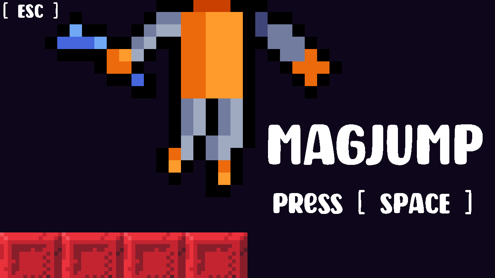

# Magjump - GMTK Game Jam 2021 Submission (Reworked)

<h2> Introduction </h2>
For the GMTK Game Jam 2021, I created a 2D challenging platformer prototype inspired by games like Celeste and Super Meat Boy that follows the theme: Joined Together. In this game, the player cannot jump. Instead, they can use magnets to repel off magnetically charged platforms to simulate the motion of jumping. Also, the player can use these Magnets to attract Platforms to perform various platforming stunts. <a target="_blank" href="https://jamjes.itch.io/magjump">Click Here </a> to view the submission page and play the demo made in under 48hrs. 

This repository will be the continuation of this game jam to create a more polished game mechanic to industry standards. 

<h2>Trailer </h2>
<i> Coming Soon </i>
  
<h2> How to download/play this project </h2>
Step 1. Click on the green ‘CODE’ button to open the sub-menu. 
Step 2. Inside the ‘LOCAL’ tab, click on download ZIP. 
Step 3. Once the file has been downloaded, extract the zip using your software of choice 
Step 4. Navigate to Builds >> Latest Build >> Magjump.exe 
  
<h2> Known Bugs </h2>
Current Version: 2.0.1
 
All known bugs will be logged here with a record of their current status. 
